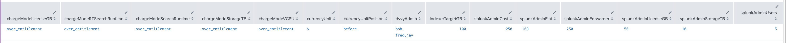
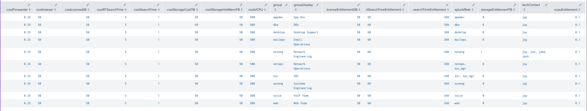
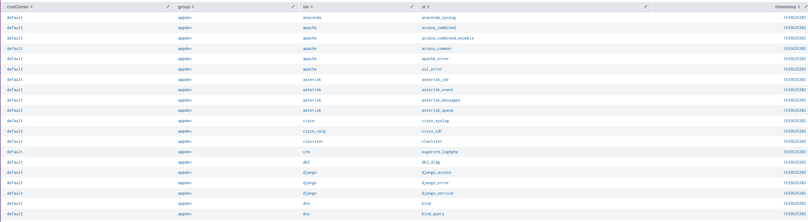
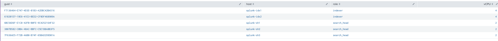

# dvvy Installation & Configuration

Read on for information pertaining to the installation and
configuration of the dvvy Chargeback app for Splunk Enterprise, 
part of the RedFactor Success Suite.

## Before installing dvvy 

### Define customers 

Create an organization identifier ("Org ID") structure for all of the
teams, departments, lines of business, etc. This structure should
reflect the way you intend to report on utilization and charges. Below
is a simple example:

<table>
<colgroup>
<col style="width: 55%" />
<col style="width: 44%" />
</colgroup>
<thead>
<tr class="header">
<th><strong>Group</strong> (group_display field in dvvyGroups)</th>
<th><strong>Org ID</strong> (group field in dvvyGroups)</th>
</tr>
</thead>
<tbody>
<tr class="odd">
<td>Network Operations Center (NOC)</td>
<td>noc</td>
</tr>
<tr class="even">
<td>Security Operations Center (SOC)</td>
<td>soc</td>
</tr>
<tr class="odd">
<td>Application Development</td>
<td>appdev</td>
</tr>
<tr class="even">
<td>Systems Engineering</td>
<td>syseng</td>
</tr>
</tbody>
</table>

Once you have defined your Org IDs, add a stanza to your inputs.conf
files (and any HEC sources) throughout your environment to create the
index-time field (pipeline key). This field will establish data
ownership for dvvy dashboards and reports.

Any data source that you want to track in dvvy must have an Org ID
assigned. The dvvy app will automatically track data sources that
contain the field by way if the *KV - Track Data* report.

### Implement data source tagging

Update forwarder and other inputs.conf configuration on a data source by
data source basis with Org ID (see the \_meta parameter on line 2 of the
sample inputs below).

**inputs.conf Example:**

<table>
<colgroup>
<col style="width: 50%" />
<col style="width: 50%" />
</colgroup>
<thead>
<tr class="header">
<th>NOC Data Source:</th>
<th>SOC Data Source:</th>
</tr>
</thead>
<tbody>
<tr class="odd">
<td>
[monitor:///var/log/syslog]

_meta = org_id::noc

disabled = false

index = linux

sourcetype = syslog
</td>
<td>
[monitor:///var/log/syslog]

_meta = org_id::soc

disabled = false

index = linux

sourcetype = syslog

</td>
</tr>
</tbody>
</table>

The example above creates an index-time field of **org\_id** with values
of "noc" and "soc" respectively.

You are not required to use the field name org\_id - any field name can
be used. If you use a field other than org\_id, you will need to update
the **CUSTOMER\_IDENTIFIER** macro accordingly. Org IDs can be any
alphanumeric value.

## Install the dvvy app

The dvvy app is installed on your search tier only (standalone or search
head cluster). It relies upon the KV store and summary indexes. It is
recommended that you follow Splunk best practices, to include forwarding
your summary indexes from your search heads to your indexers.

We recommend the use of the Lookup File Editor app for working with dvvy kv store 
collections.

### Set global configuration

All global configuration is stored in the **dvvyConfig** KV store
collection.

Below is an explanation of the configuration parameters:

-   **chargeModeLicenseGB**: Controls how data ingest (GB volume)
    charges are calculated. Possible values: simple, over\_entitlement

-   **chargeModeRTSearchRuntime**: Controls how real-time search runtime
    charges are calculated. Possible values: simple, over\_entitlement

-   **chargeModeSearchRuntime**: Controls how search runtime charges are
    calculated. Possible values: simple, over\_entitlement

-   **chargeModeStorageTB**: Controls how storage charges are
    calculated. Possible values: simple, over\_entitlement

-   **chargeModeVCPU**: Controls how VCPU charges are calculated.
    Possible values: simple, over\_entitlement

Charge Modes:

simple: The entitlement values in the customer configuration are used
only for reporting and do not impact charge calculations (a customer
with 100 GB of ingest and a 50 GB entitlement is charged for 100 GB).
This was the only option prior to dvvy 1.5.0.  
  
over\_entitlement: The entitlement values in the customer configuration
change how charges are calculation (a customer with 100 GB of ingest and
a 50 GB entitlement is charged for 50 GB).

-   **currencyUnit**: The currency symbol to use in dashboards. Possible
    values: $, €,£, etc.

-   **currencyUnitPosition**: The position of the currency symbol in
    dashboards. Possible values: before, after

-   **dvvyAdmin**: A comma-separated list of Splunk usernames that have
    access to *all* dvvy customer data in dashboards.

-   **indexerTargetGB**: The daily indexing target per indexer in GB
    based on your architecture and sizing. Used for Indexer Load (IDXL)
    calculation, a simple methodology to represent indexer consumption
    as a whole.

-   **kvkitBaseURL:** The URL of the kvkit application if installed.

-   **splunkAdminCost**: The daily cost of a Splunk
    Administrator/Engineer to use in admin chargeback calculations (ex:
    $150,000 yearly salary = $410.95 daily)

-   **splunkAdminFlat**: A flat daily fee to apply to all customers as
    part of admin chargeback.

-   **splunkAdminForwarder**: The quantity of forwarders a single Splunk
    admin can support (used to calculate Splunk Admin Load)

-   **splunkAdminLicenseGB**: The amount of license (GB) a single Splunk
    admin can support (used to calculate Splunk Admin Load)

-   **splunkAdminStorage**: The amount of storage (TB) a single admin
    can support (used to calculate Splunk Admin Load)

-   **splunkAdminUsers**: The number of users a single admin can support
    (used to calculate Splunk Admin Load)

See *Recommended Configuration Workflow* below for recommendations of
working with data in KV store collections.

### Configure customers

Customers are defined in the *dvvyGroups* KV store collection.

Below are the available parameters:

-   **costForwarder:** The daily rate per 100 forwarders

-   **costIndexer:** The daily rate for indexer load

-   **costLicenseGB:** The daily rate for 1 GB of data ingest

-   **costRTSearchTime**: The daily rate for 1 second of real-time
    search runtime

-   **costSearchTime**: The daily rate for 1 second of search runtime

-   **costStorageColdTB:** The daily rate for 1 TB of cold storage

-   **costStorageHotWarmTB**: The daily rate for 1 TB of hot/warm
    storage

-   **costVCPU:** The daily rate for 1 VCPU

-   **group:** The org\_id value for the customer (i.e., "noc" or "soc"
    from the earlier example)

-   **groupDisplay:** The customer display name (i.e., friendly name)
    for dashboard presentation

-   **licenseEntitlementGB:** The amount of data ingest (GB/day)
    allocated to the customer for chargeback and reporting purposes

-   **rtSearchTimeEntitlement:** The amount of real-time search runtime
    (seconds) allocated to the customer for chargeback and reporting
    purposes

-   **searchTimeEntitlment:** The amount of search runtime (seconds)
    allocated to the customer for chargeback and reporting purposes

-   **splunkRole:** A comma-separated list of Splunk roles associated
    with the customer (used for Splunk Admin Load charge calculation)

-   **storageEntitlementGB:** The total amount of storage allocated to a
    given group for reporting purposes

-   **techContact:** A comma-separated list of Splunk usernames that are
    affiliated with the group and can access dvvy

-   **vcpuEntitlement:** The quantity of virtual CPUs (vCPU) allocated
    to the customer for chargeback and reporting purposes

See *Recommended Configuration Workflow* below for recommendations of
working with data in KV store collections.

### Update data tracking

Update the **CUSTOMER\_IDENTIFIER** macro with the field you've defined
for your Org ID. By default, the value is org\_id. It can be set to
anything. Once data is flowing with your Org ID defined and the other
app configuration is in place, run the **KV - Track Data** report. This
will write all data to the dvvyData collection. This report is scheduled
to run daily out of the box. Running it manually is only required to
accelerate the implementation process.

Do not manually update dvvyData contents. If you need to add a
costCenter or make modifications, it is recommended that you alter the
logic of the **KV - Track Data** report.

The **KV - Track Data** report will add the following information to the
dvvyData collection for any untracked data source:

-   **group:** The Org ID associated with the source type

-   **idx:** The index

-   **st:** The source type

-   **costCenter:** The cost center will be set to "default" unless
    search is modified with lookup

-   **timestamp:** Timestamp of when the data source was added to dvvy
    (added automatically)

### Populate Splunk environment details

Run the **KV - Splunk Infrastructure** report to capture system specs of
indexers and search heads in your environment. This search is not
scheduled by default - please schedule to effectively capture any
changes in your environment at a frequency that makes sense.

If your environment changes (e.g., add/remove an indexer or search head)
and you do not run the report, VCPU reporting will not be accurate.

### Review and update dvvy summary index configurations

The dvvy app relies on three (3) summary indexes for operation. Create
the following indexes on your indexers:

-   **dvvy\_event\_summary:** Customer event counts from the
    *Utilization Summary - Events* search.

-   **dvvy\_usage\_summary:** Customer utilization from all other
    *Utilization Summary* searches.

-   **dvvy\_charge\_summary:** Customer charge calculations from all
    *Cost Summary* searches.

### Add cost center information (optional)

Optionally add accounting cost centers to the **dvvyCostCenters**
collection to further partition the data for reporting.

-   **costCenter**: The cost center code

-   **costCenterDescription**: The cost center display name for
    dashboards

Once added to **dvvyCostCenters**, you will need to add costCenter to
each data source in **dvvyData**. This can be done manually or
programmatically. Consider creating a lookup table to populate this
field.

If cost centers aren't required, you might this field as an internal
identifier or reference to enhance reporting.

### Validate and schedule daily search jobs

When you install dvvy, all of the necessary utilization and calculation
reports are enabled and scheduled. By default, all jobs are scheduled to
run overnight for the prior day's events with the exception of the
"Utilization Summary - License GB" search that runs every five (5)
minutes by default.

Saved searches in Splunk run as the owner by default. When dvvy is
installed, ownership will not be set ('nobody' ownership in meta) . This
will cause the saved searches to interpret the report schedules as UTC
and then apply the timezone offset (i.e., -4 for EDT, etc.). This may
break the schedule by causing the searches to span two days. **All
reports must execute during the same day.**

Set ownership on all saved searches to an admin's account with the
correct local time zone via Reassign Knowledge Objects and restart
Splunk. After restart, confirm that the saved searches starting with
**Utilization Summary - Events** is intended to kick off at 12:03 AM
nightly.

Although the schedule, time ranges/frequency, etc. can be changed to
meet your requirements, daily search jobs must execute in a specific
order due to dependencies. Consider removing the | collect command when
testing searches to avoid writing data to summaries prematurely.

<table>
<colgroup>
<col style="width: 10%" />
<col style="width: 9%" />
<col style="width: 14%" />
<col style="width: 15%" />
<col style="width: 30%" />
<col style="width: 19%" />
</colgroup>
<thead>
<tr class="header">
<th><strong>Report</strong></th>
<th><strong>Schedule Sequence</strong></th>
<th><strong>Description</strong></th>
<th><strong>Dependencies</strong></th>
<th><strong>Relevant Configuration</strong></th>
<th><strong>Index</strong></th>
</tr>
</thead>
<tbody>
<tr class="odd">
<td>Utilization Summary - Events</td>
<td>1</td>
<td>Percentage of data ownership by customer based on index and
sourcetype. This allows for overlapping data sources (i.e., same
index/sourcetype used by multiple customers).</td>
<td></td>
<td></td>
<td>dvvy_event_summary</td>
</tr>
<tr class="even">
<td>Utilization Summary - License GB</td>
<td>2</td>
<td>Data ingest by customer.</td>
<td><ul>
<li>
Utilization Summary - Events
</li>
</ul></td>
<td></td>
<td>dvvy_usage_summary</td>
</tr>
<tr class="odd">
<td>Utilization Summary - Storage</td>
<td>3</td>
<td>Hot/warm and cold storage utilization by customer.</td>
<td><ul>
<li>
Utilization Summary - Events
</li>
</ul></td>
<td></td>
<td>dvvy_usage_summary</td>
</tr>
<tr class="even">
<td>Utilization Summary - Forwarders</td>
<td>4</td>
<td>Quantity of forwarders by customer.</td>
<td></td>
<td></td>
<td>dvvy_usage_summary</td>
</tr>
<tr class="odd">
<td>Utilization Summary - Search</td>
<td>5</td>
<td>Runtime (seconds) for search activity by customer.</td>
<td></td>
<td></td>
<td>dvvy_usage_summary</td>
</tr>
<tr class="even">
<td>Utilization Summary - CPU</td>
<td>6</td>
<td>Average vCPU utilization and related metrics by customer.</td>
<td></td>
<td></td>
<td>dvvy_usage_summary</td>
</tr>
<tr class="odd">
<td>Cost Summary - License GB</td>
<td>7</td>
<td>License chargeback by customer.</td>
<td><ul>
<li>
Utilization Summary - License GB
</li>
</ul></td>
<td><ul>
<li>
costLicenseGB in dvvyGroups
</li>
<li>
licenseEntitlementGB in dvvyGroups
</li>
</ul></td>
<td>dvvy_charge_summary</td>
</tr>
<tr class="even">
<td>Cost Summary - Storage</td>
<td>8</td>
<td>Storage chargeback by customer.</td>
<td><ul>
<li>
Utilization Summary - Storage
</li>
</ul></td>
<td><ul>
<li>
costStorageColdTB in dvvyGroups
</li>
<li>
costStorageHotWarmTB in dvvyGroups
</li>
<li>
storageEntitlementTB in dvvyGroups
</li>
</ul></td>
<td>dvvy_charge_summary</td>
</tr>
<tr class="odd">
<td>Cost Summary - Search</td>
<td>9</td>
<td>Search runtime (seconds) chargeback by customer.</td>
<td><ul>
<li>
Utilization Summary - Search
</li>
</ul></td>
<td><ul>
<li>
costSearchTime in dvvyGroups
</li>
<li>
searchTimeEntitlement in dvvyGroups
</li>
</ul></td>
<td>dvvy_charge_summary</td>
</tr>
<tr class="even">
<td>Cost Summary - RT Search</td>
<td>10</td>
<td>Realtime search runtime (seconds) chargeback by customer.</td>
<td><ul>
<li>
Utilization Summary - Search
</li>
</ul></td>
<td><ul>
<li>
costRTSearchTime in dvvyGroups
</li>
<li>
rtSearchTimeEntitlement in dvvyGroups
</li>
</ul></td>
<td>dvvy_charge_summary</td>
</tr>
<tr class="odd">
<td>Cost Summary - CPU</td>
<td>11</td>
<td>vCPU chargeback by customer that compares search, realtime search,
and data ingest between customers against available resources.</td>
<td><ul>
<li>
Utilization Summary - CPU
</li>
<li>
Cost Summary - Search
</li>
<li>
Cost Summary - RT Search
</li>
</ul></td>
<td><ul>
<li>
costVCPU in dvvyGroups
</li>
<li>
vcpuEntitlement in dvvyGroups
</li>
</ul></td>
<td>dvvy_charge_summary</td>
</tr>
<tr class="even">
<td>Cost Summary - Forwarders</td>
<td>12</td>
<td>Forwarder chargeback by customer (per 100 forwarders).</td>
<td></td>
<td><ul>
<li>
splunkAdminLicense in dvvyConfig
</li>
</ul></td>
<td>dvvy_charge_summary</td>
</tr>
<tr class="odd">
<td>Cost Summary - Indexer Simple</td>
<td>13</td>
<td>Indexer chargeback based on target sizing. Chargeback is based on
Indexer Load (IDXL), where 1 IDXL = 1 indexer based on sizing.</td>
<td><ul>
<li>
Utilization Summary - License GB
</li>
</ul></td>
<td><ul>
<li>
indexerTargetGB in dvvyConfig defines target per-indexer
sizing
</li>
<li>
costIndexer in dvvyGroups
</li>
</ul></td>
<td>dvvy_charge_summary</td>
</tr>
<tr class="even">
<td>Utilization Summary - Admin - License GB</td>
<td>14</td>
<td>Splunk Admin Load (SAL) based on per-FTE license quantity</td>
<td></td>
<td><ul>
<li>
splunkAdminLicense in dvvyConfig
</li>
</ul></td>
<td>dvvy_usage_summary</td>
</tr>
<tr class="odd">
<td>Utilization Summary - Admin - Storage</td>
<td>15</td>
<td>Splunk Admin Load (SAL) based on per-FTE storage quantity.</td>
<td></td>
<td><ul>
<li>
splunkAdminStorage in dvvyConfig
</li>
</ul></td>
<td>dvvy_usage_summary</td>
</tr>
<tr class="even">
<td>Utilization Summary - Admin - Users</td>
<td>16</td>
<td>Splunk Admin Load (SAL) based on per-FTE user quantity.</td>
<td></td>
<td><ul>
<li>
splunkAdminUsers in dvvyConfig
</li>
<li>
splunkRole in dvvyGroups provides group mapping and user
counts
</li>
</ul></td>
<td>dvvy_usage_summary</td>
</tr>
<tr class="odd">
<td>Utilization Summary - Admin - Forwarders</td>
<td>17</td>
<td>Splunk Admin Load (SAL) based on per-FTE forwarder quantity.</td>
<td></td>
<td><ul>
<li>
splunkAdminForwarders in dvvyConfig
</li>
</ul></td>
<td>dvvy_usage_summary</td>
</tr>
<tr class="even">
<td>Cost Summary - Flat Admin Fee</td>
<td>18</td>
<td>Flat admin fee applied to every customer.</td>
<td></td>
<td><ul>
<li>
splunkAdminFlat in dvvyConfig
</li>
</ul></td>
<td>dvvy_charge_summary</td>
</tr>
<tr class="odd">
<td>Cost Summary - Admin</td>
<td>19</td>
<td>Combined Splunk Admin Load (SAL) chargeback for license, storage,
users, and forwarders.</td>
<td></td>
<td><ul>
<li>
splunkAdminCost defines daily Splunk Admin FTE rate for
chargeback calculation
</li>
</ul></td>
<td>dvvy_charge_summary</td>
</tr>
</tbody>
</table>

Contact us for scripts and other assets to streamline dvvy testing
before going live.

### Confirm dashboards are populating

If you run the searches in the sequence above (manually or via our handy
shell script), dashboards should populate. All dashboards only search
against the \*\_cost\_summary indexes. Dashboard filters are restricted
to customer affiliation as defined by techContact in dvvyGroups. Any
users listed in dvvyAdmin in the dvvyConfig collection will have access
to all app data in the dashboards. Once everything is populated to your
liking, to include the charge calculations, clean (or | delete) all of
dvvy indexes so that reporting is not skewed.

## Recommended Configuration Workflow

All RedFactor customers with a dvvy app license automagically have a
zero-cost [kvkit](https://kvkit.com/) license. Kvkit is a lightweight
Node/Express application that sits outside of Splunk and interacts with
the the KV store via REST API. It can be used to create web-based forms
that can be used to easily update dvvy configuration.

In lieu of kvkit, please us the [Lookup File
Editor](https://splunkbase.splunk.com/app/1724/) app.

## KV Store Collections

The dvvy app leverages KV store collections for all request operations.
The table below lists the collections and their role.

<table>
<colgroup>
<col style="width: 30%" />
<col style="width: 69%" />
</colgroup>
<thead>
<tr class="header">
<th><strong>Collection Name</strong></th>
<th><strong>Description</strong></th>
</tr>
</thead>
<tbody>
<tr class="odd">
<td>dvvyConfig</td>
<td>Global app configuration options</td>
</tr>
<tr class="even">
<td>dvvyCostCenters</td>
<td>Cost center information</td>
</tr>
<tr class="odd">
<td>dvvyData</td>
<td>Data sources tracked by dvvy</td>
</tr>
<tr class="even">
<td>dvvyGroups</td>
<td>Group ("customer") configuration</td>
</tr>
<tr class="odd">
<td>dvvySplunkInfrastructure</td>
<td>Splunk environment information used for vCPU chargeback</td>
</tr>
</tbody>
</table>

## KV Store Backup

Since some of the app data is stored in KV store collections and
collections are susceptible to accidental deletion or overwrite (e.g.,
unintentional outputlookup by an admin), it is highly recommended that
you regularly backup all dvvy collections to prevent data loss.

If you are using the kvkit application, you can easily make on-demand
backups or schedule automated backups based on crontab syntax.

Backups can be performed via CLI, like so:

$SPLUNK\_HOME/bin/splunk backup kvstore \[-archiveName &lt;archive&gt;\]
\[-collectionName &lt;collection&gt;\] \[-appName &lt;app&gt;\]

Using the above syntax as a guide, running this command:

/opt/splunk/bin/splunk backup kvstore -archiveName dvvyData
-collectionName dvvyData -appName dvvy

will generate a .tar.gz archive in
/opt/splunk/var/lib/splunk/kvstorebackup.

The archive will contain a JSON file with the contents of the dvvyData
collection which could be used to restore. 

Consider scheduling this command with cron (or equivalent) or creating a
simple shell script to streamline the process of backing up each dvvy
collection. Please see [Backup and Restore the KV
store](https://docs.splunk.com/Documentation/Splunk/7.2.3/Admin/BackupKVstore)
in the Admin Manual for official Splunk guidance on the topic.
